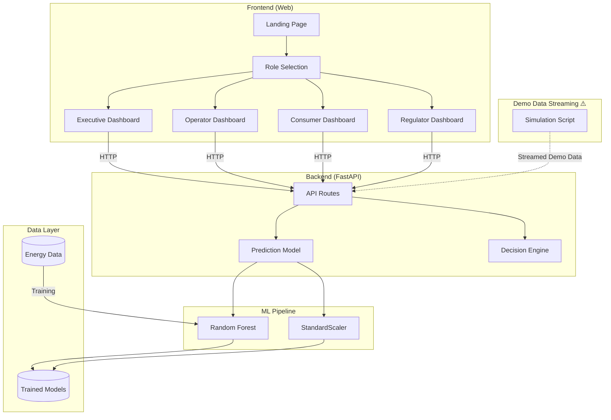

<h1 align="center">⚡ GridMind AI – Autonomous Decision Engine for Smart Energy Grids</h1>

> <p align="center">🚀 <strong>An AI-powered platform that predicts energy demand, optimizes grid decisions, and explains AI reasoning in real time for modern energy networks.</strong></p>

<div align="center">

<a href="http://localhost:3000" target="_blank">
    
</a>


</div>

## ✨ Features

GridMind AI combines predictive AI, reinforcement learning, and explainable AI to help energy operators make optimal decisions in real time.

* ⚡ **Demand Forecasting** – Predicts next-hour energy demand using Random Forest ML model
* 🧠 **AI Decision Engine** – Recommends optimal grid actions (battery discharge/charge, load reduction, grid import)
* 📊 **Explainable AI** – Feature importance visualization showing what influences predictions (Temperature, Hour, Solar, Load)
* 🎮 **Scenario Simulator** – Interactive controls to simulate different conditions (temperature, solar output, load, time)
* 👥 **Multi-Role Access** – Role-based dashboards for Executive, Operator, Consumer, and Regulator

## 🎯 Use Cases & Roles

| Role | Description |
|------|-------------|
| ⚡ **Energy Executive** | Executive-level analytics, strategic insights, and high-level grid performance metrics |
| 🎛️ **Grid Operator** | Real-time grid monitoring, AI decisions, and operational control center |
| 🏠 **Consumer** | Personal energy usage tracking, consumption analytics, and billing management |
| 📋 **Regulator** | Compliance monitoring, grid reliability metrics, and regulatory reporting |

---

## ⚙️ Platform Support

<table border="1" cellpadding="10" cellspacing="0">
  <thead>
    <tr>
      <th>Platform</th>
      <th>Minimum Requirements</th>
      <th>Supported?</th>
    </tr>
  </thead>
  <tbody>
    <tr>
      <td>Web Application (Fully Responsive)</td>
      <td>Modern Browser (Chrome, Brave, Edge, Firefox, etc)</td>
      <td>✅</td>
    </tr>
  </tbody>
</table>

---

## 🛠️ Tech Stack

### Frontend

* Next.js 16
* React 19
* Tailwind CSS v4
* TypeScript
* Recharts (Data Visualization)
* shadcn/ui Components
* Framer Motion (Animations)

### Backend

* **Framework**: FastAPI (Python)
* **ML**: scikit-learn (Random Forest Regressor)
* **Data Processing**: pandas, numpy

### ML Models

* **Random Forest** – Demand forecasting with 100 trees
* **Feature Scaling** – StandardScaler for normalization
* **Feature Set**: hour, day_of_week, temperature, solar_output, current_load

---

## 🚀 Getting Started

### 1️⃣ Clone the Repository

```bash
cd smart-energy-grids
```

### 2️⃣ Backend Setup

```bash
cd backend/app

# Install dependencies
pip install -r requirements.txt

# Train the ML model
python train_model.py

# Run the server
python -m uvicorn main:app --host 0.0.0.0 --port 8000
```

The API will be available at `http://localhost:8000`
- API Docs: `http://localhost:8000/docs`
- ReDoc: `http://localhost:8000/redoc`

### 3️⃣ Frontend Setup

```bash
cd frontend
npm install
npm run dev
```

Open `http://localhost:3000`

---

## 📁 Folder Structure

```
smart-energy-grids/
│
├── backend/                 # FastAPI backend
│   ├── app/                # Application modules
│   │   ├── __init__.py
│   │   ├── main.py         # FastAPI server entry point
│   │   ├── predict.py      # ML prediction model
│   │   ├── decision_engine.py  # AI decision logic
│   │   └── train_model.py  # Model training script
│   ├── data/               # Training data
│   │   └── energy_data.csv
│   ├── models/             # Trained ML models
│   │   ├── energy_model.pkl
│   │   ├── scaler.pkl
│   │   └── features.pkl
│   └── requirements.txt    # Python dependencies
│
├── frontend/               # Next.js frontend
│   ├── src/
│   │   ├── app/           # App router pages
│   │   │   ├── (public)/ # Landing page
│   │   │   ├── auth/      # Role selection
│   │   │   ├── app/       # Original dashboard
│   │   │   ├── executive/ # Energy Executive dashboard
│   │   │   ├── operator/  # Grid Operator dashboard
│   │   │   ├── consumer/  # Consumer dashboard
│   │   │   └── regulator/ # Regulator dashboard
│   │   ├── components/   # UI components
│   │   │   └── ui/        # shadcn components
│   │   └── lib/           # Utilities & API client
│   │       ├── api.ts
│   │       └── utils.ts
│   └── package.json
│
├── CONTEXT.txt            # Project requirements & design
└── README.md
```

---

## 🏛️ Project Architecture



---

## 📱 Dashboard Features

### Energy Executive Dashboard (`/executive/dashboard`)
| Panel | Description |
|-------|-------------|
| **KPI Cards** | Total demand, operational cost, grid efficiency, consumers served |
| **Demand Trend** | Area chart showing forecast vs actual monthly demand |
| **Power Source Mix** | Pie chart of current generation by source |
| **Renewable Integration** | Line chart of solar/wind performance over time |
| **Cost Breakdown** | Bar chart of operational cost categories |

### Grid Operator Dashboard (`/operator/dashboard`)
| Panel | Description |
|-------|-------------|
| **Status Indicators** | Grid frequency, voltage, battery status, AI system status |
| **Power Sources** | Real-time output from solar, wind, hydro, nuclear, coal, gas |
| **Demand Forecast** | Line chart showing next 5 hours prediction |
| **AI Decision** | Recommended action with amount and reasoning |
| **AI Explanation** | Bar chart showing feature importance |
| **Scenario Simulator** | Interactive sliders for temperature, solar, load, hour |

### Consumer Dashboard (`/consumer/dashboard`)
| Panel | Description |
|-------|-------------|
| **Current Usage** | Real-time power consumption and cost per hour |
| **Monthly Cost** | Total cost and kWh used this month |
| **Savings** | Amount saved vs average |
| **Green Energy** | Percentage of renewable sources used |
| **Daily Usage** | Line chart of weekly consumption pattern |
| **Appliance Breakdown** | Bar chart of energy usage by category |
| **Peak Hours** | List of highest usage time periods |
| **Billing** | Current balance and due date |

### Regulator Dashboard (`/regulator/dashboard`)
| Panel | Description |
|-------|-------------|
| **Compliance Score** | Overall compliance percentage |
| **Grid Uptime** | Reliability percentage |
| **Safety Incidents** | Number of incidents this quarter |
| **Reports Due** | Number of pending reports |
| **Compliance Trend** | Line chart of monthly compliance scores |
| **Reliability Metrics** | SAIDI, SAIFI, CAIDI, ASAI metrics |
| **Compliance Standards** | Status of safety, environmental, grid reliability standards |
| **Alerts** | Recent compliance and safety notifications |

---

## 📊 API Endpoints

| Endpoint | Method | Description |
|----------|--------|-------------|
| `/predict` | POST | Predict energy demand |
| `/decision` | POST | Get AI decision recommendation |
| `/explain` | GET | Get feature importance |
| `/simulate` | POST | Run scenario simulation |
| `/data/sample` | GET | Get sample energy data |
| `/data/power-sources` | GET | Get power source data |
| `/data/executive` | GET | Get executive dashboard data |
| `/data/operator` | GET | Get operator dashboard data |
| `/data/consumer` | GET | Get consumer dashboard data |
| `/data/regulator` | GET | Get regulator dashboard data |
| `/status` | GET | API status |

---

## 🔬 Example Request & Response

### Request

```json
POST /decision
{
  "hour": 18,
  "day_of_week": 3,
  "temperature": 28,
  "solar_output": 2.5,
  "current_load": 10
}
```

### Response

```json
{
  "predicted_demand": 12.7,
  "decision": {
    "action": "battery_discharge",
    "amount": 2.1,
    "unit": "MW",
    "reason": "High demand predicted (12.7 MW). Activate battery storage to reduce grid load."
  },
  "timestamp": "2026-04-09T10:30:00"
}
```

---

## 📊 Project Stats

<div align="center">


</div>

---

## 🔐 Disclaimer

GridMind AI provides probabilistic predictions based on ML models.
For production deployment, integrate real-time sensor data and grid constraints.

---

## ✍️ Endnote

<p align="center">⚡ Power the future of energy with autonomous AI decisions.</p>

---

## 🏷 Tags

`ai` `energy` `smart-grid` `machine-learning` `fastapi` `nextjs` `react` `demand-forecasting` `decision-intelligence` `explainable-ai` `renewable-energy` `battery-optimization` `grid-management` `power-systems` `random-forest` `python` `typescript`
